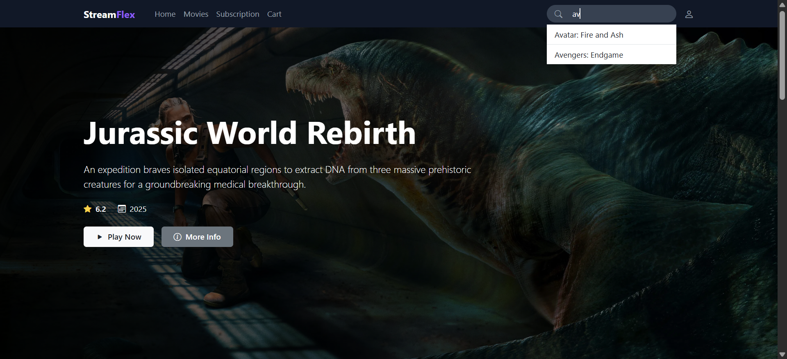
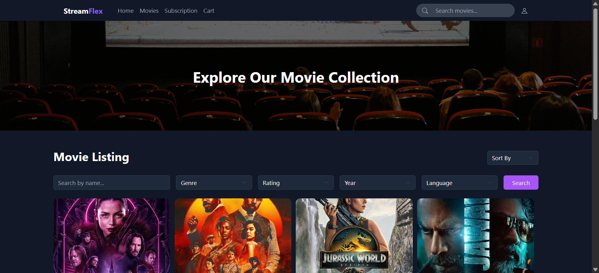
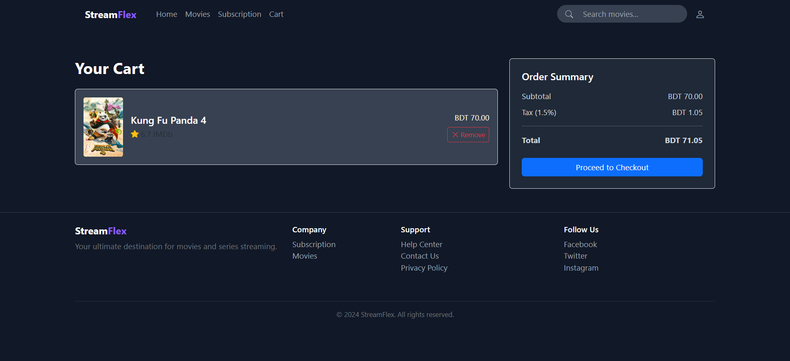
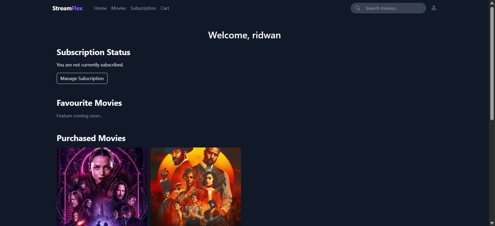
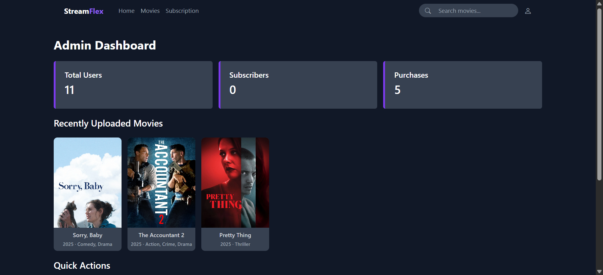
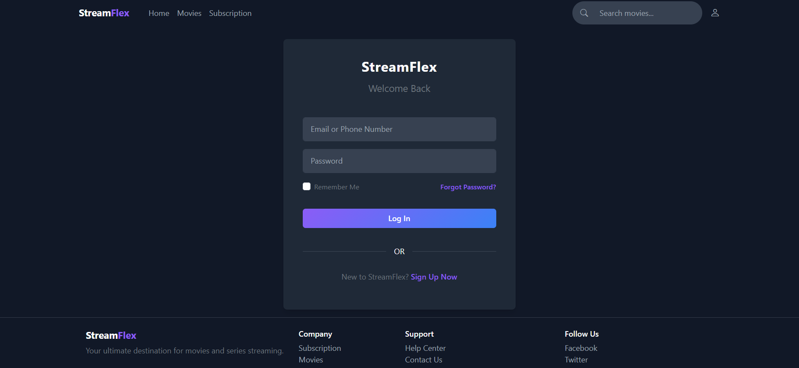

# StreamFlex - Movie Streaming Platform

StreamFlex is a comprehensive movie streaming web application built with PHP and MySQL. It allows users to browse, purchase, and stream movies, while providing administrators with powerful tools to manage content and users.

## 🚀 Features

### User Features
*   **User Authentication**: Secure login and registration system.
*   **Movie Browsing**: Browse a vast collection of movies with filtering options.
*   **Movie Details**: View detailed information about movies including descriptions, ratings, and trailers.
*   **Streaming**: Watch movies directly within the platform.
*   **Shopping Cart**: Add movies to a cart for purchase.
*   **Subscription & Payments**: Integrated payment gateway for subscriptions and movie purchases.
*   **User Dashboard**: Manage profile, view purchase history, and subscription status.

### Admin Features
*   **Admin Dashboard**: Overview of platform statistics (users, movies, subscriptions).
*   **Movie Management**: Add, edit, delete, and upload new movies.
*   **User Management**: View and manage registered users.
*   **Content Control**: Update movie details, posters, and streaming files.

## 🛠️ Tech Stack

*   **Frontend**: HTML5, CSS3, JavaScript
*   **Backend**: PHP
*   **Database**: MySQL
*   **Server**: Apache (XAMPP/WAMP recommended)

## 📸 Screenshots

### Home Page


### Movie Listing


### Movie Purchase & Cart


### User Profile


### Admin Dashboard


### Authentication


## ⚙️ Installation & Setup

1.  **Clone the Repository**
    ```bash
    git clone https://github.com/Tanvir-Chowdhury/StreamFlex_movie_streaming_platform.git
    cd streamflex
    ```

2.  **Set up the Database**
    *   Open your MySQL database management tool (e.g., phpMyAdmin).
    *   Create a new database named `streamflex`.
    *   Import the `streamflex.sql` file located in the root directory of this project.

3.  **Configure Database Connection**
    *   Open `connection.php`.
    *   Update the database credentials if necessary (Default: Host: `localhost`, User: `root`, Password: ``).

    ```php
    $servername = "localhost";
    $username = "root";
    $password = "";
    $db = "streamflex";
    ```

4.  **Run the Application**
    *   Move the project folder to your server's root directory (e.g., `htdocs` for XAMPP or `www` for WAMP).
    *   Open your browser and navigate to `http://localhost/streamflex`.

## 📂 Project Structure

```
streamflex/
├── api/                 # API endpoints
├── css/                 # Stylesheets
├── images/              # Static images
├── js/                  # JavaScript files
├── screenshots/         # Project screenshots
├── stream/              # Video stream resources
├── admin_*.php          # Admin related pages
├── user_*.php           # User related pages
├── movie_*.php          # Movie related pages
├── connection.php       # Database connection
├── streamflex.sql       # Database schema
└── index.php            # Entry point
```

## 🤝 Contributing

Contributions are welcome! Please feel free to submit a Pull Request.

1.  Fork the project
2.  Create your feature branch (`git checkout -b feature/AmazingFeature`)
3.  Commit your changes (`git commit -m 'Add some AmazingFeature'`)
4.  Push to the branch (`git push origin feature/AmazingFeature`)
5.  Open a Pull Request

## 📄 License

This project is open source and available under the [MIT License](LICENSE).
